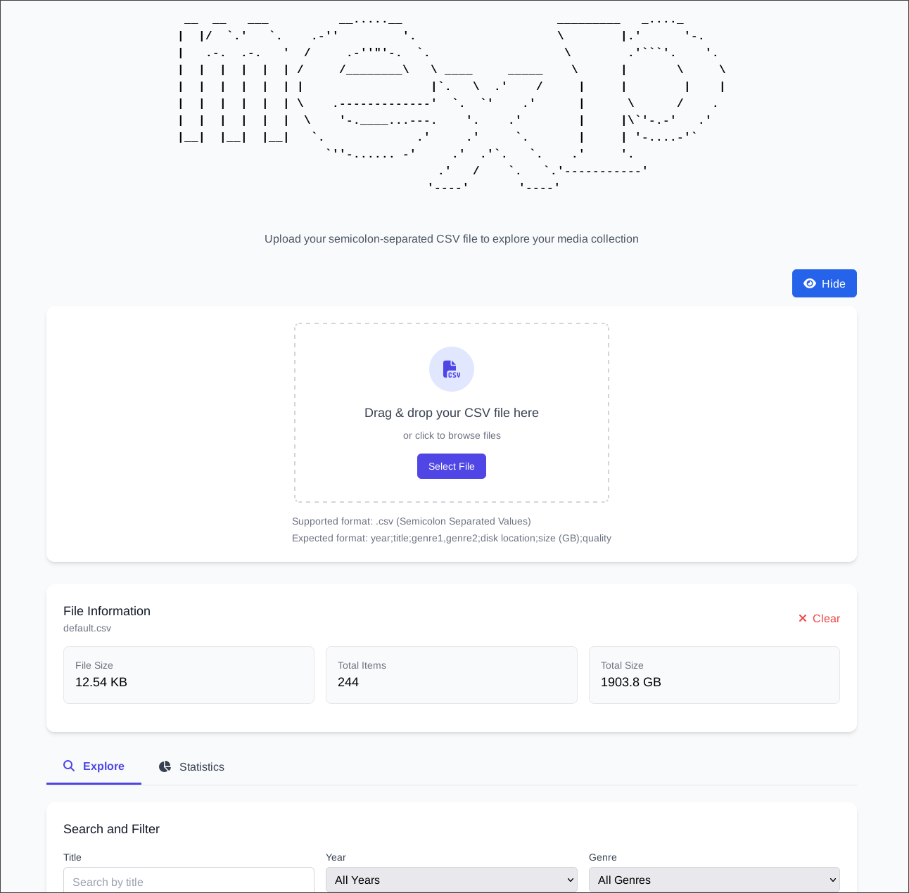
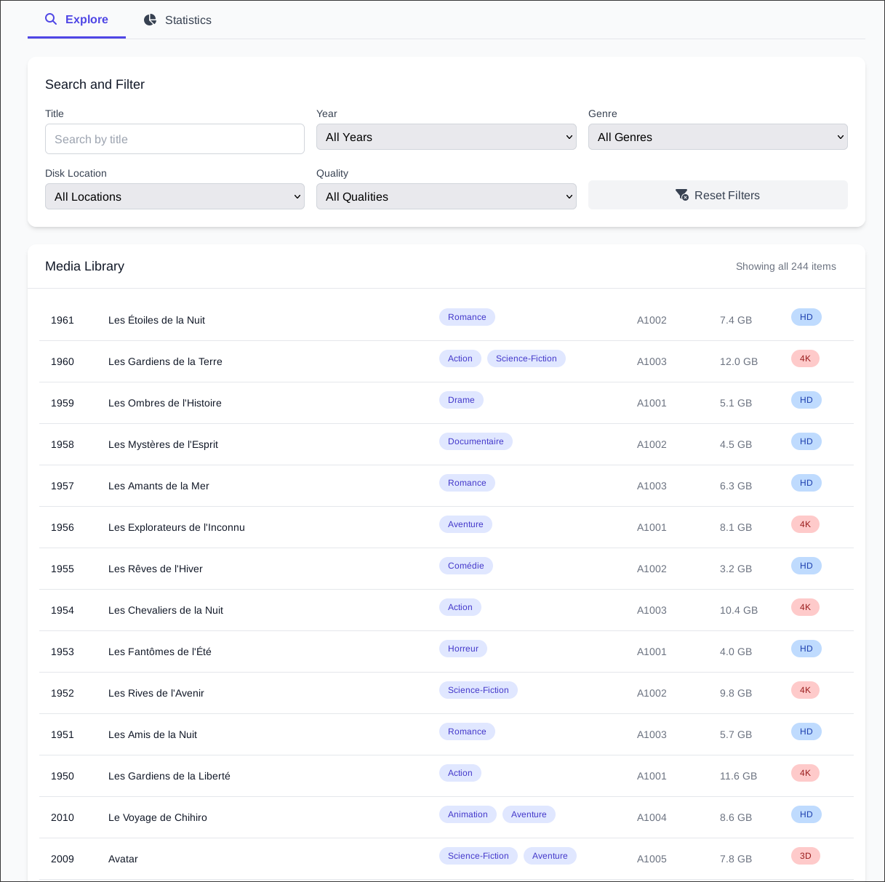
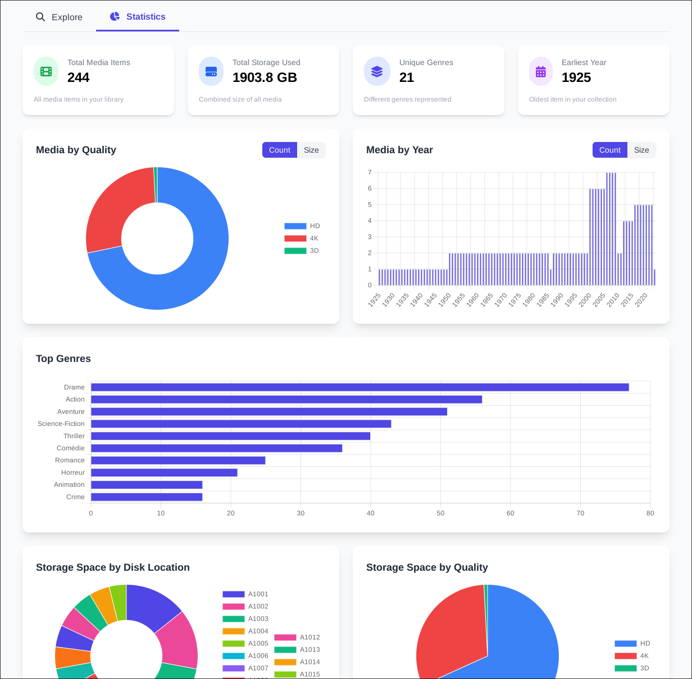
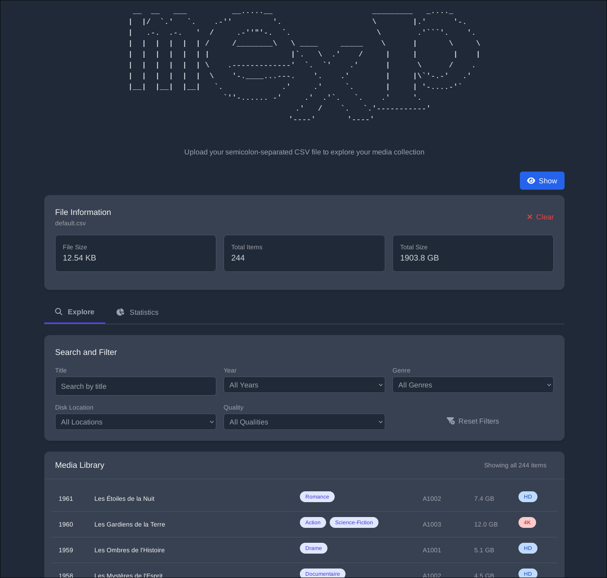

```plaintext
 __  __   ___          __.....__                      _________   _...._      
|  |/  `.'   `.    .-''         '.                    \        |.'      '-.   
|   .-.  .-.   '  /     .-''"'-.  `.                   \        .'```'.    '. 
|  |  |  |  |  | /     /________\   \ ____     _____    \      |       \     \
|  |  |  |  |  | |                  |`.   \  .'    /     |     |        |    |
|  |  |  |  |  | \    .-------------'  `.  `'    .'      |      \      /    . 
|  |  |  |  |  |  \    '-.____...---.    '.    .'        |     |\`'-.-'   .'  
|__|  |__|  |__|   `.             .'     .'     `.       |     | '-....-'`    
                     `''-...... -'     .'  .'`.   `.    .'     '.             
                                     .'   /    `.   `.'-----------'           
                                    '----'       '----'                                  
```

# CSV Movie Explorer

CSV Movie Explorer is a web application that allows you to import and explore a CSV file. You can filter and search your media as well as view detailed statistics.

## Preview 
<details>
<summary><i>Click to expand</i></summary>

</br>
</br>
</br>
</br>

</details>

## Features

- **CSV Import**: Load a CSV file containing your media. The expected format is:
  ```
  year;title;genre1,genre2;disk location;size (GB);quality
  ```
- **Search and Filtering**: Filter your media by title, year, genre, location, and quality.
- **Dynamic Statistics**: View key information such as:
  - Total number of media
  - Total space used
  - Unique genres present in the library
  - Oldest year
- **Interactive Charts**: Several charts (doughnut, bar, horizontal bar, pie, and line chart) present data on quality, year, genres, locations, and an overall trend.
- **Dark Mode**: Easily toggle between light mode and dark mode with a dedicated button.
- **Responsive Design**: The application is designed to be used on different types of devices using Tailwind CSS.

## Technologies Used

- **HTML5** – Page structure.
- **CSS / Tailwind CSS** – Styling and layout (including dark mode).
- **JavaScript (ES6)** – Application logic and event handling.
- **Chart.js** – Creating and updating charts.
- **Font Awesome** – Icons to enhance the interface.
- **Nginx** – Web server for serving static files and reverse proxying.
- **Docker** – Containerization for consistent development and deployment environments.
- **npm** – Package manager for JavaScript, used for managing project dependencies.
- **Vite** – Build tool and development server for modern web applications, providing fast hot module replacement.
- **Nix** – (optional) A package manager and build system that allows for reproducible builds and development environments, used with a `shell.nix` file to define project-specific dependencies and environment settings.

## License

This project is licensed under the MIT License. See the [LICENSE](LICENSE) file for more details.

## Disclaimer

This project utilizes AI assistance for code writing and development. While AI can enhance productivity and provide useful suggestions, it is important to review and test all code generated or assisted by AI thoroughly. The authors of this project do not guarantee the accuracy, reliability, or completeness of any AI-generated code. Users are encouraged to apply their own judgment and expertise when implementing AI-assisted code in their projects.
